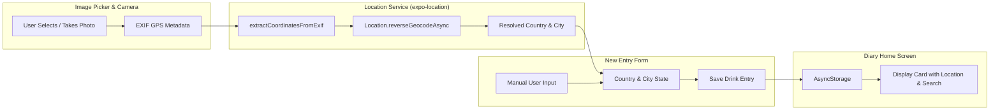

# Requirements

### Overview & Goals
Add a structured location input consisting of **Country** and **City** to drink tasting entries in Tasteney. By default, when a user attaches or captures photos for an entry, the geolocation coordinates from the last image's EXIF metadata should be extracted and reverse-geocoded using `expo-location` into the corresponding Country and City fields. Users can also view, edit, or manually enter Country and City anytime.

### Scope
- **In Scope**:
  - Installing and configuring `expo-location` for coordinate reverse geocoding.
  - Enabling EXIF extraction (`exif: true`) in `ImageSelector` (`expo-image-picker`).
  - Helper service to parse GPS coordinates from EXIF metadata across iOS and Android formats.
  - Updating `DrinkEntry` type to include `country?: string` and `city?: string`.
  - Location input UI in `NewEntryScreen` (`src/app/index/new-entry.tsx`) with Country and City text fields and auto-detection badge.
  - Preserving manual user edits while offering automatic resolution on image upload/capture.
  - Displaying location on drink cards in `DiaryHomeScreen` (`src/app/index/index.tsx`) and including country/city in diary search filtering.
- **Out of Scope**:
  - Live GPS tracking of device location when no image is present (can be added as a separate enhancement).
  - Interactive map view / pins (retained for future release).

### User Stories
- **As a drink enthusiast**, when I select a photo of a wine bottle or coffee roastery that has GPS metadata, I want the country and city to automatically populate so that I don't have to look up and type them manually.
- **As a user**, I want to be able to manually type or modify the Country and City if the photo doesn't contain GPS data or if I want to adjust the location.
- **As a user browsing my diary**, I want to see where each drink was enjoyed or originated and search my entries by city or country.

### Functional Requirements
1. **EXIF GPS Extraction**:
   - `ImagePicker.launchImageLibraryAsync` and `ImagePicker.launchCameraAsync` must request EXIF data (`exif: true`).
   - Parse EXIF tags (such as `GPSLatitude`, `GPSLongitude`, `GPSLatitudeRef`, `GPSLongitudeRef`, or nested GPS structures).
2. **Reverse Geocoding with Expo**:
   - Use `expo-location` (`reverseGeocodeAsync`) to resolve extracted `{ latitude, longitude }` into standard `country` and `city` (falling back to region/subregion if city is omitted).
3. **New Entry Screen UI**:
   - Add Country and City inputs with clear labels, placeholders, and themed cards.
   - Automatically populate Country and City from the last attached image when available.
   - Allow user manual override without being overridden on every re-render.
4. **Diary Home Card & Search**:
   - Render `📍 [City, Country]` or `📍 [Country]` on drink entry cards.
   - Include `country` and `city` fields in the search query filter.

### Non-Functional Requirements
- **Resilience**: If reverse geocoding fails (e.g. offline, no permissions, missing EXIF), the app fails gracefully without errors, keeping inputs empty for manual entry.
- **Performance**: Reverse geocoding runs asynchronously without blocking the UI.

# Technical Design

### Current Implementation
- `src/types/drink.ts`: Defines `DrinkEntry` with `name`, `manufacturer`, `rating`, `notes`, `images`, `archetype`, `subtype`, `sensoryDescriptors`, `createdAt`.
- `src/components/image-selector.tsx`: Uses `expo-image-picker` (`launchImageLibraryAsync`, `launchCameraAsync`) without `exif: true` enabled and only returns URI strings (`images: string[]`).
- `src/app/index/new-entry.tsx`: Contains form sections for Archetype, Subtype, Visual Record, Identity (Name & Manufacturer), Rating, Sensory, Notes.
- `src/services/storage.ts`: Persists `DrinkEntry` objects in `@react-native-async-storage/async-storage`.
- `src/app/index/index.tsx`: Lists drink cards and filters by archetype and search query.

### Key Decisions
1. **EXIF Coordinate Parsing & Expo Reverse Geocoding**:
   - *Choice*: Use `expo-location`'s `reverseGeocodeAsync` for reverse geocoding, combined with a robust EXIF GPS coordinate normalizer.
   - *Rationale*: Expo's official `expo-location` package provides native geocoding on iOS and Android without third-party API keys or external billing.
2. **Default Population Strategy**:
   - *Choice*: When a photo is added (or multiple photos are selected), inspect the latest/last asset for GPS coordinates. If coordinates exist, trigger reverse geocoding and set Country and City fields.
   - *Rationale*: Matches the user requirement ("By default, this should be taken from the last images geolocation and resolved with expo") while allowing manual edits anytime.
3. **Data Model Representation**:
   - *Choice*: Add `country?: string;` and `city?: string;` directly to `DrinkEntry`.
   - *Rationale*: Keeps querying, filtering, and serialization straightforward and backwards-compatible with existing saved entries.

### Data Models / Contracts
```ts
// src/types/drink.ts
export interface DrinkEntry {
  id: string;
  name: string;
  manufacturer: string;
  country?: string;  // e.g. "France", "Japan", "United States"
  city?: string;     // e.g. "Bordeaux", "Kyoto", "San Francisco"
  rating: number;
  notes: string;
  images: string[];
  archetype: BeverageArchetype;
  subtype?: string;
  sensoryDescriptors?: SensoryDescriptor[];
  createdAt: string;
}
```

### Architecture Diagram


### Components & File Structure
- `tasteney/package.json`: Add `expo-location`.
- `tasteney/src/types/drink.ts`: Add `country` and `city` to `DrinkEntry`.
- `tasteney/src/services/location.ts`:
  - `extractCoordinatesFromExif(exif)`: Parses `{ GPSLatitude, GPSLongitude, ... }` or `{ Latitude, Longitude }` to `{ latitude, longitude }`.
  - `resolveLocationFromAsset(asset)`: Extracts coordinates and calls `reverseGeocodeAsync`.
- `tasteney/src/components/image-selector.tsx`:
  - Enable `exif: true` in picker and camera calls.
  - Expose callback `onImageAssetsAdded?: (assets: ImagePicker.ImagePickerAsset[]) => void` to notify parent of newly added assets with EXIF.
- `../../tasteney/src/app/entry/new-entry.tsx`:
  - Manage `country` and `city` state.
  - Add Country and City inputs with location icons and styling under Drink Identity / Origin section.
  - Trigger reverse geocoding on new image assets and auto-fill empty fields.
- `../../tasteney/src/app/entry/index.tsx`:
  - Show `📍 [City, Country]` in drink card.
  - Include `country` and `city` in search filtering.

### Edge Cases & Error Handling
- **No EXIF or GPS stripped by privacy/platform**: Leaves country and city empty or untouched, allowing quick manual entry.
- **Offline / Geocoding failure**: Catches geocoding errors silently without crashing the app or blocking photo upload.
- **Multiple photos selected at once**: Picks the last asset with valid coordinates as specified in the requirement.
- **Existing entries without location**: Gracefully handled with optional `country?: string` and `city?: string`.

# Testing

### Validation Approach
Verify the implementation using unit tests and simulator/device validation for EXIF parsing, reverse geocoding, form population, and search indexing.

### Key Scenarios
1. **Photo with EXIF GPS Added**:
   - User attaches a photo containing GPS coordinates.
   - Reverse geocoding resolves latitude/longitude to City and Country.
   - Form fields for Country and City automatically populate with resolved values.
2. **Manual Override**:
   - User edits or types City and Country manually.
   - Manual edits are preserved and saved correctly into storage.
3. **Photo without EXIF GPS**:
   - User attaches an image without GPS metadata.
   - Form fields remain editable with no crash or error alerts.
4. **Diary Display & Search**:
   - Saved entries show City and Country on diary cards.
   - Searching for country name (e.g. "Italy") or city name (e.g. "Florence") matches and filters the list accordingly.
5. **Entry Editing**:
   - Opening an existing drink entry in edit mode loads its saved `country` and `city`.

### Test Changes
- Add unit tests for `extractCoordinatesFromExif` testing various EXIF formats (decimal, DMS, iOS GPS dictionary format, negative coordinate handling).
- Add tests for `saveDrinkEntry` and `getDrinkEntries` verifying serialization and retrieval of `country` and `city`.

# Delivery Steps

### ✓ Step 1: Setup expo-location and EXIF reverse-geocoding service
The project has `expo-location` installed and a dedicated helper utility to extract GPS coordinates from EXIF metadata and reverse-geocode them to Country and City.

- Install `expo-location` using `npx expo install expo-location`.
- Create `src/services/location.ts` (or utility under `src/utils/exif-location.ts`) with functions:
  - `extractCoordinatesFromExif(exif: Record<string, any> | undefined): { latitude: number; longitude: number } | null` supporting decimal, DMS, and standard GPS EXIF dictionary structures (`GPSLatitude`, `GPSLongitude`, `GPSLatitudeRef`, `GPSLongitudeRef`).
  - `resolveLocationFromCoordinates(coords: { latitude: number; longitude: number }): Promise<{ country?: string; city?: string } | null>` using `Location.reverseGeocodeAsync`.
  - `resolveLocationFromAsset(asset: ImagePicker.ImagePickerAsset): Promise<{ country?: string; city?: string } | null>`.

### ✓ Step 2: Update DrinkEntry model and storage persistence
The drink data model and storage layer support optional `country` and `city` properties.

- Update `DrinkEntry` interface in `src/types/drink.ts` to include optional fields: `country?: string;` and `city?: string;`.
- Verify and update `src/services/storage.ts` functions (`saveDrinkEntry`, `getDrinkEntries`, `getDrinkEntryById`) to persist and retrieve `country` and `city` attributes seamlessly.

### ✓ Step 3: Integrate location inputs and auto-detection in NewEntryScreen and ImageSelector
The New Entry screen provides Country and City input fields and automatically populates them from the last added photo's EXIF geolocation.

- Update `src/components/image-selector.tsx`:
  - Pass `exif: true` to `ImagePicker.launchImageLibraryAsync` and `ImagePicker.launchCameraAsync`.
  - Pass full asset details or trigger an `onImagesAdded?: (assets: ImagePicker.ImagePickerAsset[]) => void` callback on photo addition.
- Update `src/app/index/new-entry.tsx`:
  - Add state variables `country` and `city`.
  - When new photos are added or when the last photo changes, extract EXIF GPS metadata, reverse geocode via `resolveLocationFromAsset`, and auto-fill `country` and `city` if they are currently blank or upon user confirmation.
  - Add a styled "LOCATION & ORIGIN" section with Country and City `TextInput`s, matching the existing design system (`surfaceContainerLow`, icons, typography).
  - Add an auto-detection status badge (e.g., "Auto-detected from photo") with an option to refresh or edit.
  - Load existing `country` and `city` values when editing an existing entry in `useEffect`.
  - Save `country` and `city` in `handleSave`.

### ✓ Step 4: Display location and enable search in DiaryHomeScreen
Drink entries show country and city tags on their diary cards, and the search bar matches entries by location.

- Update `src/app/index/index.tsx`:
  - In `renderItem`, display the resolved location (e.g., `📍 City, Country` or formatted origin) alongside or below the manufacturer.
  - Update `filteredEntries` search predicate to match against `item.country` and `item.city` in addition to existing drink name, manufacturer, subtype, and notes.