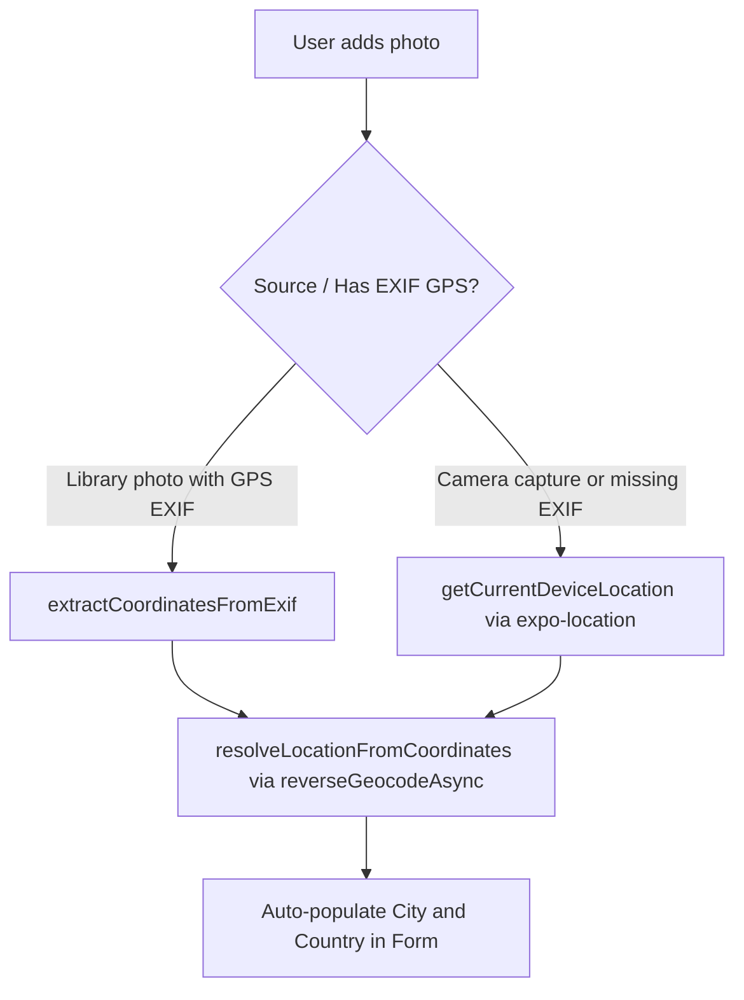

# Requirements

### Overview & Root Cause
When a user selects an existing photo from the photo library (`launchImageLibraryAsync`), the image was previously taken and saved by the native operating system Camera app, which automatically records GPS metadata into the image file's EXIF tags (`GPSLatitude`, `GPSLongitude`, `{GPS}`).

However, when a user captures a photo directly inside the app using `ImagePicker.launchCameraAsync({ quality: 0.8, exif: true })`:
1. **No GPS tags in captured EXIF**: The in-app camera picker (`UIImagePickerController` on iOS and Camera Intent on Android) does not automatically embed GPS coordinates into newly taken photo assets.
2. **Missing Location Permission**: `ImagePicker.requestCameraPermissionsAsync()` only requests camera access, not location access.
3. **Strict EXIF dependency**: `resolveLocationFromAsset()` in `tasteney/src/services/location.ts` strictly inspects `asset.exif`. Because `asset.exif` lacks GPS tags, `extractCoordinatesFromExif` returns `null`, causing position detection to fail silently.

### Scope
- **In Scope**:
  - Direct explanation of why EXIF GPS is absent in camera captures.
  - Adding fallback device location detection via `expo-location` (`Location.getCurrentPositionAsync`) when taking a photo or when EXIF GPS is missing.
  - Updating `tasteney/src/services/location.ts` and `tasteney/src/app/new-entry.tsx` to support the fallback.
  - Adding iOS and Android location permission configurations in `tasteney/app.json`.
- **Out of Scope**:
  - Continuous background location tracking.
  - Manual map-pin location picker UI.

### User Stories
- As a user taking a photo of a drink directly with the camera, I want the app to automatically detect the current city and country so that I don't have to manually type the location.
- As a user selecting an older photo from my library, I want the app to use the photo's original EXIF GPS location if available, preserving the place where the photo was originally taken.

### Functional Requirements
- When picking an image from the library: Attempt to extract EXIF GPS location first.
- When taking a live photo with the camera: Automatically fall back to fetching current device GPS coordinates if EXIF metadata does not contain GPS tags.
- Reverse-geocode coordinates to extract city and country and populate the entry form.
- Gracefully handle permission denials without crashing or blocking photo entry creation.

# Technical Design

### Current Implementation
- `tasteney/src/components/image-selector.tsx`:
  - `handlePickFromLibrary` calls `ImagePicker.launchImageLibraryAsync({ exif: true })`.
  - `handleTakePhoto` calls `ImagePicker.launchCameraAsync({ exif: true })`.
  - Both pass the resulting `result.assets` to `onImagesAdded`.
- `tasteney/src/app/new-entry.tsx`:
  - `handleImagesAdded` iterates over assets and invokes `resolveLocationFromAsset(asset)`.
- `tasteney/src/services/location.ts`:
  - `resolveLocationFromAsset` calls `extractCoordinatesFromExif(asset.exif)`.
  - When capturing with `launchCameraAsync`, `asset.exif` has camera settings (ISO, Model, Exposure) but lacks GPS coordinates, resulting in `extractCoordinatesFromExif` returning `null`.

### Key Decisions
- **Decision: Two-tier Location Resolution (EXIF First, Device GPS Fallback)**:
  - For library images: Prioritize EXIF GPS data to reflect the historical capture location.
  - For camera photos or images without EXIF GPS: Fall back to `Location.getCurrentPositionAsync()` using `expo-location`.
  - *Rationale*: Capturing a photo in-app happens in real-time, so the current device position corresponds directly to where the beverage is being enjoyed.

### Proposed Architecture & Flow

### File Structure & Changes
- `tasteney/src/services/location.ts`:
  - Export `getCurrentDeviceLocation()` that requests foreground permissions and fetches `Location.getCurrentPositionAsync()`.
- `tasteney/src/app/new-entry.tsx`:
  - In `handleImagesAdded`, if `resolveLocationFromAsset(asset)` returns `null`, call `getCurrentDeviceLocation()` as fallback.
- `tasteney/app.json`:
  - Add `NSLocationWhenInUseUsageDescription` in `ios.infoPlist`.
  - Add `ACCESS_FINE_LOCATION` and `ACCESS_COARSE_LOCATION` to Android permissions.

# Testing

### Validation Approach
- Verify location extraction across both photo selection modes:
  1. Image library selection with GPS EXIF.
  2. In-app camera capture with device GPS fallback.
- Verify permission flows (granted, denied, error recovery).

### Key Scenarios
- **Scenario 1: Camera photo capture with location permission granted**
  - Action: User taps 'Attach Photo' -> 'Take Photo' and snaps an image.
  - Expected: App queries device location, reverse geocodes coordinates, and sets `country` and `city` with detected location badge.
- **Scenario 2: Library photo with existing EXIF GPS**
  - Action: User picks an image from photo library that has GPS EXIF metadata.
  - Expected: App parses EXIF coordinates and sets `country` and `city` corresponding to photo metadata.
- **Scenario 3: Permission denied / GPS disabled**
  - Action: User denies location permission or device GPS is unavailable.
  - Expected: No crash occurs, entry form remains editable, and user can manually type city and country.

# Delivery Steps

### ✓ Step 1: Add device location retrieval helper in location service
The location service provides helper functions to request device location permissions and fetch the current device location as a fallback when EXIF data is missing.

- Add `getCurrentDeviceLocation()` and `requestLocationPermissions()` in `tasteney/src/services/location.ts`.
- Integrate `Location.requestForegroundPermissionsAsync()` and `Location.getCurrentPositionAsync()` with appropriate accuracy and timeout settings.
- Implement reverse geocoding of the retrieved device coordinates using existing `resolveLocationFromCoordinates()`.
- Add unit/service validation to ensure graceful fallback when location permissions are denied or GPS is unavailable.

### ✓ Step 2: Integrate device location fallback into photo capture and entry flow
When a photo is taken via camera or when an image lacks EXIF GPS data, the app automatically falls back to current device location to populate country and city.

- Update `handleImagesAdded` in `tasteney/src/app/new-entry.tsx` to call `getCurrentDeviceLocation()` if `resolveLocationFromAsset(asset)` returns null.
- Update `tasteney/src/components/image-selector.tsx` if needed to request location permission or flag live camera captures.
- Ensure the location loading indicator (`isGeocodingLocation`) and auto-detected badge (`autoDetectedLocation`) work seamlessly for both camera capture and photo library picking.

### ✓ Step 3: Configure platform permissions and test error handling
App configuration includes the necessary iOS and Android location permission strings and gracefully handles user permission denials.

- Add `NSLocationWhenInUseUsageDescription` in `tasteney/app.json` under `expo.ios.infoPlist`.
- Add `ACCESS_FINE_LOCATION` and `ACCESS_COARSE_LOCATION` permissions under `expo.android.permissions` in `tasteney/app.json`.
- Ensure appropriate non-blocking UI feedback when location permissions are rejected by the user.