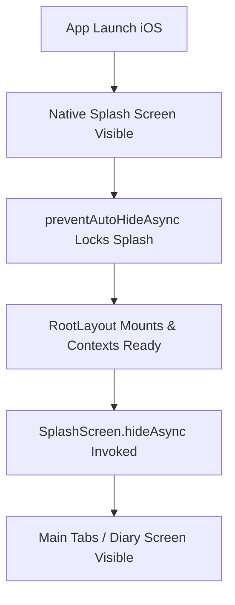

# Requirements

### Overview & Goals
When launching the app on a physical iPhone, the app freezes on the splash screen and is eventually terminated by the iOS watchdog (`Watchdog: App took too long to run its background task expiration handlers and/or willTerminate handlers. Exiting immediately! (4.9s)`).

The root cause is that `SplashScreen.preventAutoHideAsync()` is invoked at module load in `src/app/_layout.tsx` to hold the native splash screen, but `SplashScreen.hideAsync()` is never called anywhere in the app to dismiss it. As a result, native iOS keeps the splash screen active and watchdog assertions fail during lifecycle transitions.

The goal is to properly dismiss the splash screen as soon as the root layout is mounted and ready.

### Scope
- **In Scope**:
  - Implement splash screen dismissal in `src/app/_layout.tsx` once the layout tree mounts.
  - Add robust error handling to prevent unhandled promise rejections on splash hide.
- **Out of Scope**:
  - Modifying splash assets or `app.json` configuration.
  - Changes to underlying tab screens or storage services.

### User Stories
- As an iPhone user, I want the app to smoothly transition from the splash screen into the main Diary screen upon launch, so that I can use the app without freezes or watchdog crashes.

### Functional Requirements
- The splash screen must remain visible during initial JavaScript execution to prevent screen flicker.
- The splash screen must be dismissed via `SplashScreen.hideAsync()` immediately after `RootLayout` mounts.
- Splash screen dismissal errors must be handled gracefully without crashing the app on any platform.

# Technical Design

### Current Implementation
In `src/app/_layout.tsx`:
- `SplashScreen.preventAutoHideAsync()` is called globally at line 10.
- `RootLayout` configures routing and theme providers, but never calls `SplashScreen.hideAsync()`.
- On physical iOS devices, the native splash overlay stays up indefinitely, preventing the transition to active UI and causing iOS watchdog lifecycle termination timeouts.

### Key Decisions
- **Mount-based Splash Dismissal**: Call `SplashScreen.hideAsync()` inside a `useEffect` with an empty dependency array in `RootLayout`.
- **Defensive Promise Handling**: Catch and log/suppress any potential rejection from `hideAsync()` in case of hot reload or platform-specific edge cases.

### Proposed Changes
- In `src/app/_layout.tsx`:
  - Add a `useEffect` hook that triggers `SplashScreen.hideAsync().catch(console.warn)` on mount.
  - Maintain `SplashScreen.preventAutoHideAsync()` at module scope to avoid initial blank frame flickers.

### File Structure
- Modified: `tasteney/src/app/_layout.tsx`

### Architecture Diagram

### Risks
- **Premature Splash Dismissal**: If dismissed before React renders, a brief white screen could flash. Placing `hideAsync()` in the initial `useEffect` of `RootLayout` guarantees the component tree is mounted before hiding.

# Testing

### Validation Approach
- Verify the splash screen lifecycle and dismissal behavior in `src/app/_layout.tsx`.
- Run static analysis and linting (`npm run lint`) to confirm clean code quality.

### Key Scenarios
- **App Launch**: The app starts with the splash screen and transitions cleanly to the Diary screen without staying stuck.
- **Subsequent Renders / Navigations**: Navigating between tabs or detail screens does not trigger duplicate splash calls.

### Edge Cases
- **Platform Compatibility**: Ensure `hideAsync()` completes safely without warnings across iOS, Android, and Web.
- **Backgrounding / Lifecycle**: Verify the app handles suspension and resumption without iOS watchdog timeout assertions.

# Delivery Steps

### ✓ Step 1: Add splash screen dismissal logic to RootLayout
The app automatically dismisses the splash screen once `RootLayout` mounts and renders.

- Modify `src/app/_layout.tsx` to add a `useEffect` hook that executes on initial component mount.
- Call `SplashScreen.hideAsync()` inside the effect with a `.catch()` handler to safely catch and ignore any platform errors or race conditions.
- Keep `SplashScreen.preventAutoHideAsync()` at module scope to prevent splash screen flicker before React renders.

### ✓ Step 2: Validate startup lifecycle and splash screen transitions
App startup lifecycle and navigation transitions are verified across platforms without splash screen hangs or errors.

- Run project linter (`npm run lint`) to ensure no syntax or code quality issues exist.
- Verify TypeScript types and build validity.
- Verify splash screen behavior and transitions into the main tab navigation on launch.